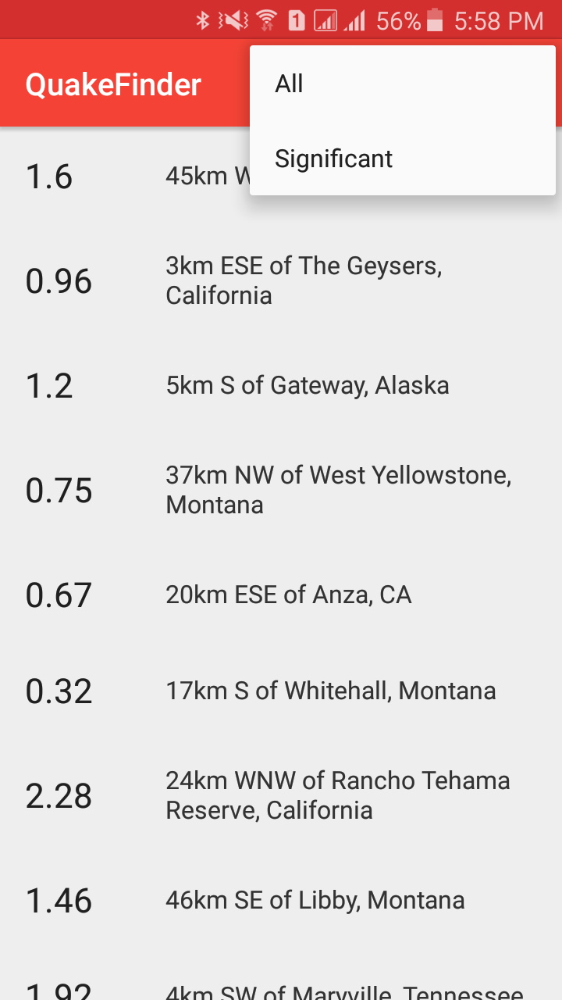

# Quake Finder

This is a simple app that displays a list of earthquakes from https://earthquake.usgs.gov/earthquakes/feed/v1.0/geojson.php. 
The user is able to choose between "all" or "significant" earthquakes that have happened in the past day. 
After clicking an item in the list the user is re-directed to the USGS website which shows detailed information about the chosen earthquake. 

## Screenshot

## Technical Design
### main
#### java
* The project is split into three packages: `data`, `sync` and `ui`
* `ui` contains `MainActivity`, `QuakeAdapter`, which is the adapter used in the `RecyclerView` and `VisibilityToggle`. `VisibilityToggle` toggles the visibility for the data, progress bar and error message, in case there are not earthquakes to display or their is no internet connection.
* `sync` contains `QuakeSyncTask`, which is an `AsyncTask` and has supporting classes `JsonUtil` and `UrlUtil`, which were completed using TDD
* `data` contains `Earthquake`, which contains the necessary data to be displayed

#### res
* `activity_main` contains the layout for `MainActivity`
* `earthquake_list_item` defines the layout for each item in the `RecyclerView`
* `menu_main` defines the menu layout

### androidTest
* `sync` contains `JsonUtilTest` and `UrlUtilTest`

## Potential Improvements
### Non-Technical
* Open up a detail view upon clicking on an item in the list, which shows more detailed information
* Show the user a map of the exact location of the earthquake
* Allow the user to search for a specific region
* Have a settings screen that allows the user to choose the severity and timeframe of the earthquake data
* Add an app icon

### Technical
* The data could be persisted using an SQLite database and managed with a content provider. This would replace `Earthquake`.
* `QuakeSyncTask` could be replaced with a `SyncAdapter` and refreshed automatically at regular intervals
